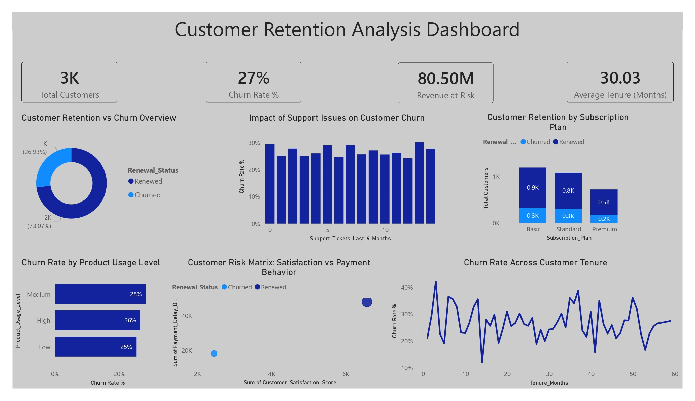

# Customer Retention Analysis Dashboard

## Project Overview

This Power BI dashboard provides a comprehensive analysis of customer retention, churn behavior, revenue risk, subscription performance, and customer satisfaction trends.

The dashboard helps businesses identify factors contributing to customer churn, evaluate retention strategies, and improve long-term customer loyalty through data-driven insights.

---

## Dashboard Preview

## Key Metrics

| KPI | Value |
|------|--------|
| Total Customers | 3,000 |
| Churn Rate | 27% |
| Revenue at Risk | $80.50M |
| Average Customer Tenure | 30.03 Months |

---

## Dashboard Features

### 1. Customer Retention vs Churn Overview
Provides an overall view of:

- Renewed Customers
- Churned Customers

Helps measure customer retention effectiveness.

---

### 2. Support Issues Impact on Churn
Analyzes the relationship between:

- Support Tickets
- Customer Churn Rate

Identifies service-related factors affecting retention.

---

### 3. Subscription Plan Retention Analysis
Compares retention performance across:

- Basic Plan
- Standard Plan
- Premium Plan

Highlights which plans achieve the highest customer loyalty.

---

### 4. Product Usage vs Churn
Measures churn rates based on customer engagement levels:

- Low Usage
- Medium Usage
- High Usage

Helps understand how product adoption impacts retention.

---

### 5. Customer Risk Matrix
Evaluates customers using:

- Satisfaction Score
- Payment Behavior
- Renewal Status

Supports proactive customer retention strategies.

---

### 6. Churn Trend Across Customer Tenure
Tracks churn patterns over the customer lifecycle and identifies high-risk periods.

---

## Business Objectives

- Reduce customer churn
- Improve customer satisfaction
- Protect recurring revenue
- Identify at-risk customers
- Optimize subscription plans
- Improve customer support performance

---

## Key Insights

### Customer Retention
- Approximately 73% of customers successfully renew subscriptions.
- Churn rate remains at 27%, indicating opportunities for retention improvements.

### Revenue Risk
- More than $80M in revenue is potentially at risk due to customer churn.

### Support Impact
- Increased support issues show a correlation with higher churn rates.

### Subscription Performance
- Basic and Standard plans contribute the largest customer base.
- Premium customers demonstrate stronger retention behavior.

### Customer Engagement
- Product usage levels influence retention outcomes.
- Low-engagement users are more susceptible to churn.

---

## Tools & Technologies

- Power BI
- DAX
- Power Query
- Excel / CSV Dataset
- Data Modeling
- Business Intelligence Reporting

---

## Skills Demonstrated

- Customer Churn Analysis
- Customer Retention Analytics
- KPI Dashboard Development
- DAX Measures
- Data Modeling
- Power Query
- Business Intelligence
- Customer Lifetime Value Analysis
- Executive Reporting

---

## Business Value

This dashboard enables organizations to:

- Identify churn drivers
- Improve customer loyalty
- Reduce revenue loss
- Enhance customer experience
- Support retention campaigns
- Make data-driven customer success decisions

---

## Author

Yashwanth Katuru

Aspiring Data Analyst | Power BI Developer | Business Intelligence Enthusiast
